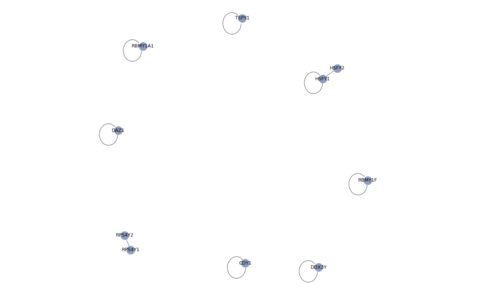
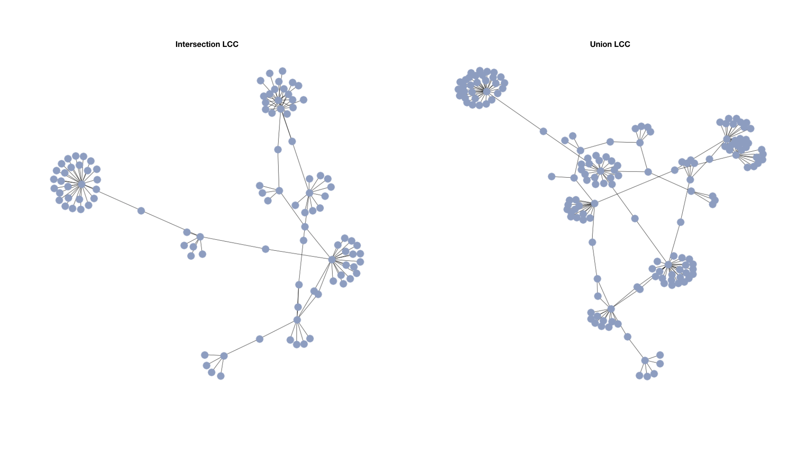
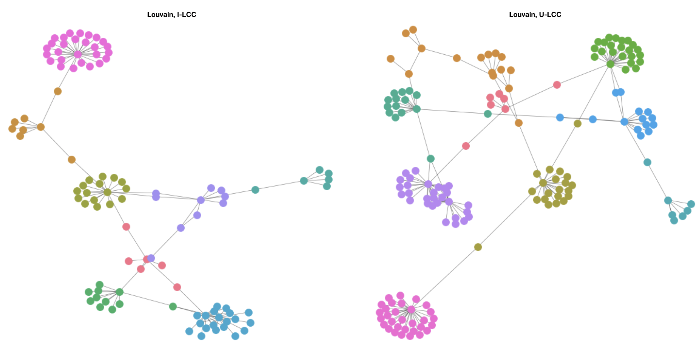
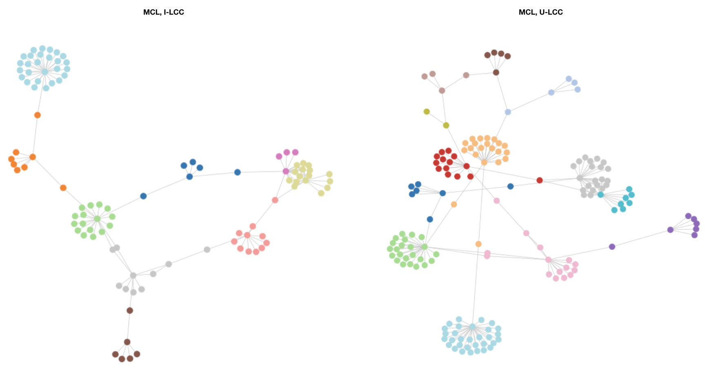

## Abstract

The aim of this work is to deeper analyze through some specific network measures the structure of seed genes interactomes (SGI), intersection (I) and union (U) interactomes, remembering that:

- *Seed Genes Interactome* contains only interactions among seed genes;

- *Union Interactome* contains interactions that involve at least one seed gene, belonging to Biogrid and IID datasets;

- *Intersection Interactome* contains interactions that involve at least one seed gene, and that are present in both belonging to Biogrid and IID datasets.

Since we are talking about interactions among genes, we can represent the interactomes with graphs, analyze their properties and try to find clusters to underline possible disease modules. Finally we also exploited DIAMonD tool to find putative disease proteins. All the files and codes involved in this work are available  in the attached folder or at
[https://github.com/tlancian/BI_Homeworks](https://github.com/tlancian/BI_Homeworks).

## Part 1. Calculate the main network measures for SGI, I and U

In this section we want to focus on graph indices, either global and local measures. In order to compute all the indices, we used the library `networkx` in Python, created to efficiently deal with graphs. We developed those analysis only on graphs with more than 20 nodes, condition respected only by U and I interactomes. Even if the SGI graph will not be considered, we provided a graphical representation in **Figure 1**. As we can see in **Table 1** some measures (as the average path length or network diameter) can not be evaluated since we are dealing with more than one component per graph. This is why we focused on the largest connected component (LCC) for union and intersection interactomes (**Figure 2**) and we evaluates some global inidices (results in **Table 2**). Local results as the node degree and centrality measures have been stored in a table in the attached folder. We just report in **Table 3** (for I-LCC) and in **Table 4** (for U-LCC) the local results for the 20 highest ranking genes for betweenness.

**INTERPRETAZIONE**

## Part 2. Apply clustering methods for disease modules discovery

Once we obtained the largest connected component for both I and U graphs, we can use two different clustering algorithms to get modules from them:

- *Louvain*: it is a method to extract communities from large networks. Basically, first small communities are found by optimizing modularity locally on all nodes, then each small community is grouped into one node and the first step is repeated. 

- *Markov Clustering (MCL)*: the main idea of this algorithm is that, starting from a node and then randomly travel to a connected node, it is more likely to stay within a cluster than travel between. The MCL algorithm is based on random walks evaluated through Markov Chains. 

The results are shown in **Figure 3** and **Figure 4**.

**INTERPRETAZIONE**

Now, applying an hypergeometric test we can explore the modules in each configuration, looking for the one statistically enriched. For each cluster belonging to each algorithm, we will evaluate an hypergeometric test with the following parameters:

- *M*, the populazion size, so the total number of genes;

- *N*, the number of genes in the module;

- *n*, the total number of seed genes in the population;

- *x*, the number of seed genes in the module.

Assuming the null hypothesis as "seed genes are not statistically overrepresented in a specific cluster", if the *p-value* will be $\leq 0.05$ then we can reject the null hypothesis. We selected modules with more than 10 nodes and with a p-value $\leq 0.05$ and we consider those modules as putative disease modules: the results are in **Table 5**.

**INTERPRETAZIONE**

## Part 3. Carry on an enrichment analysis on the disease modules

## Part 4. Find putative disease proteins using the DIAMOnD tool

\newpage

## Tables

|            Measures            | Intersection Interactome | Union Interactome |
|:------------------------------:|:------------------------:|:-----------------:|
|           # of Nodes           |            199           |        288        |
|           # of Edges           |            204           |        302        |
|    # of Connected Components   |            12            |         11        |
|       # of Isolated Nodes      |             0            |         0         |
|       Average Path Length      |             -            |         -         |
|         Average Degree         |           2.05           |        2.1        |
| Average Clustering Coefficient |          0.0068          |       0.0046      |
|        Network Diameter        |             -            |         -         |
|         Network Radius         |             -            |         -         |
|         Centralization         |           None           |        None       |
Table: global measures for Intersection and Union interactomes

|            Measures            | I - LCC | U - LCC |
|:------------------------------:|:-------:|:-------:|
|           # of Nodes           |   104   |   163   |
|           # of Edges           |   119   |   182   |
|       Average Path Length      |   5.98  |   5.93  |
|         Average Degree         |  2.288  |   2.23  |
| Average Clustering Coefficient |  0.013  |  0.008  |
|        Network Diameter        |    12   |    12   |
|         Network Radius         |    6    |    7    |
|         Centralization         |   None  |   None  |
Table: global measures for Intersection and Union LCC

|         | degree | betweenness | eigenvector | closeness |  ratio |
|:-------:|:------:|:-----------:|:-----------:|:---------:|:------:|
|  DDX3Y  |   19   |    0,6473   |    0,0013   |   0,2512  | 0,0341 |
|   SRY   |    7   |    0,4683   |    0,0001   |   0,2146  | 0,0669 |
|  SMAD3  |    2   |    0,4466   |    0,0002   |   0,2320  | 0,2233 |
|  TBL1Y  |   27   |    0,4430   |    0,0002   |   0,1782  | 0,0164 |
|  HDAC3  |    2   |    0,3906   |    0,0000   |   0,1951  | 0,1953 |
|  RPS4Y1 |    9   |    0,3185   |    0,0005   |   0,2124  | 0,0354 |
| RBMY1A1 |   18   |    0,2904   |    0,5221   |   0,1897  | 0,0161 |
|  TMSB4Y |    5   |    0,2857   |    0,0181   |   0,2141  | 0,0571 |
|   POT1  |    2   |    0,2722   |    0,0033   |   0,2289  | 0,1361 |
|  TERF1  |    2   |    0,2399   |    0,0927   |   0,1988  | 0,1199 |
|  USP9Y  |   11   |    0,2274   |    0,0456   |   0,1758  | 0,0207 |
|  RPS4Y2 |    3   |    0,1866   |    0,0015   |   0,1977  | 0,0622 |
|  CSNK1E |    2   |    0,1802   |    0,0081   |   0,1856  | 0,0901 |
|   CD81  |    2   |    0,1239   |    0,0003   |   0,2249  | 0,0619 |
|  IGSF8  |    2   |    0,1239   |    0,0003   |   0,2249  | 0,0619 |
|   CLK3  |    3   |    0,1107   |    0,1869   |   0,1761  | 0,0369 |
|  RBMY1F |   18   |    0,1079   |    0,5213   |   0,1568  | 0,0060 |
|   RNF2  |    2   |    0,0933   |    0,0001   |   0,1785  | 0,0466 |
|   ZFY   |    5   |    0,0765   |    0,0000   |   0,1535  | 0,0153 |
|  CIRBP  |    2   |    0,0048   |    0,1791   |   0,1622  | 0,0024 |
Table: Local indices for 20 highest ranking genes for betweenness, I-LCC

|           | degree | betweenness | eigenvector | closeness |  ratio |
|:---------:|:------:|:-----------:|:-----------:|:---------:|:------:|
|    SRY    |   21   |    0,5359   |    0,0002   |   0,2324  | 0,0255 |
|   DDX3Y   |   28   |    0,5249   |    0,0029   |   0,2485  | 0,0187 |
|   SMAD3   |    2   |    0,3656   |    0,0005   |   0,2379  | 0,1828 |
|   TBL1Y   |   31   |    0,3370   |    0,0001   |   0,1806  | 0,0109 |
|   HDAC3   |    2   |    0,3114   |    0,0000   |   0,2035  | 0,1557 |
|  RBMY1A1  |   24   |    0,2659   |    0,5517   |   0,1858  | 0,0111 |
|   USP9Y   |   15   |    0,2467   |    0,0436   |   0,1901  | 0,0164 |
|   RPS4Y1  |   14   |    0,2381   |    0,0006   |   0,2088  | 0,0170 |
|   TMSB4Y  |    6   |    0,2351   |    0,0168   |   0,2077  | 0,0392 |
|    POT1   |    2   |    0,2234   |    0,0032   |   0,2231  | 0,1117 |
|   TERF1   |    2   |    0,1973   |    0,0911   |   0,1929  | 0,0986 |
|     AR    |    3   |    0,1740   |    0,0000   |   0,2069  | 0,0580 |
|   TSPY1   |    8   |    0,1515   |    0,0001   |   0,1940  | 0,0189 |
|    CDY1   |    6   |    0,1257   |    0,0016   |   0,1824  | 0,0209 |
|    CLK3   |    3   |    0,1243   |    0,1734   |   0,1767  | 0,0414 |
|    UBC    |    3   |    0,1202   |    0,0074   |   0,1841  | 0,0401 |
| HIST2H2AC |    2   |    0,1155   |    0,0003   |   0,1851  | 0,0577 |
|   RBMY1F  |   21   |    0,1073   |    0,4866   |   0,1555  | 0,0051 |
|   RPS4Y2  |    3   |    0,1067   |    0,0013   |   0,1952  | 0,0356 |
|   CSNK1E  |    2   |    0,1036   |    0,0072   |   0,1860  | 0,0518 |
Table: Local indices for 20 highest ranking genes for betweenness, U-LCC

\newpage

## Figures

