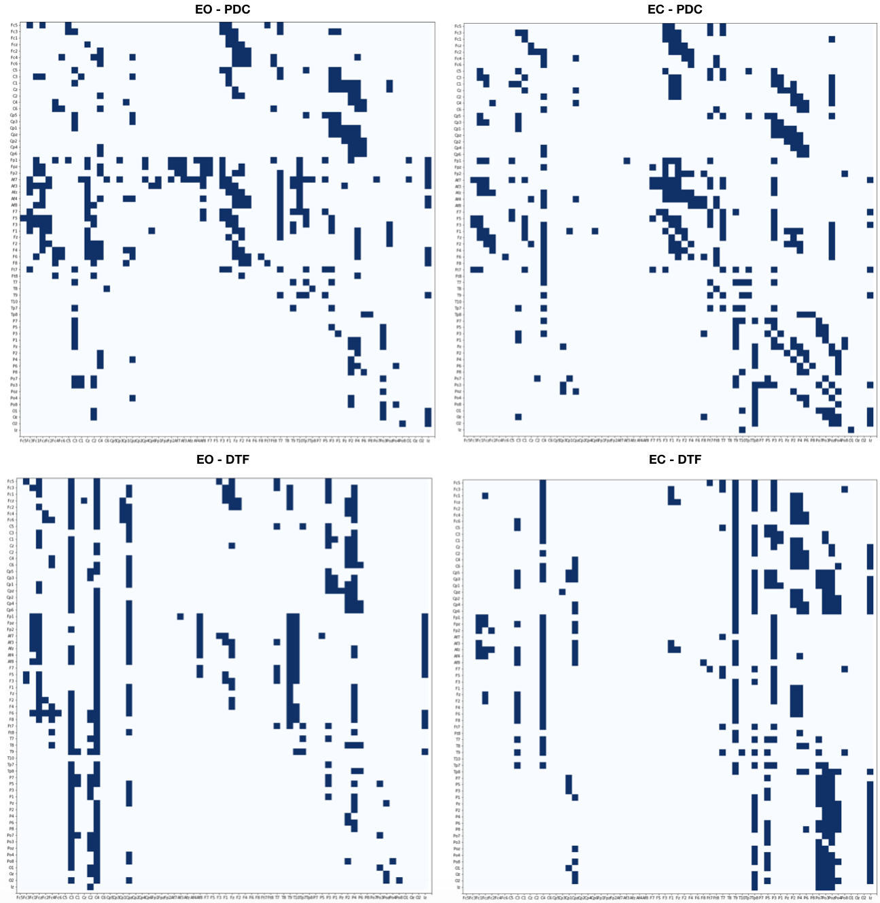
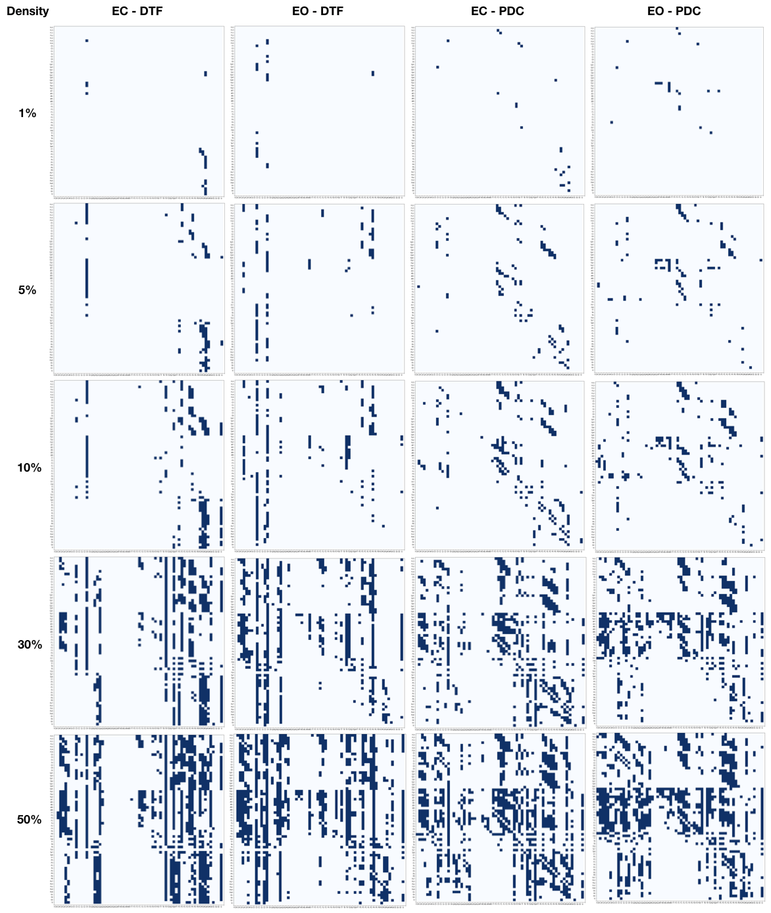
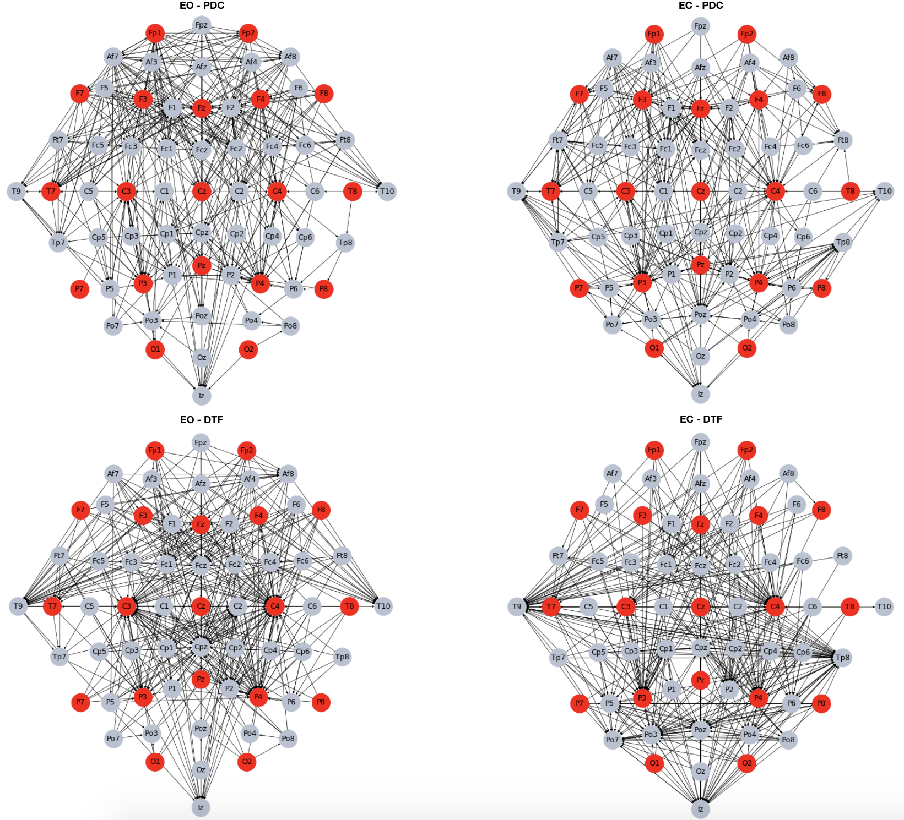
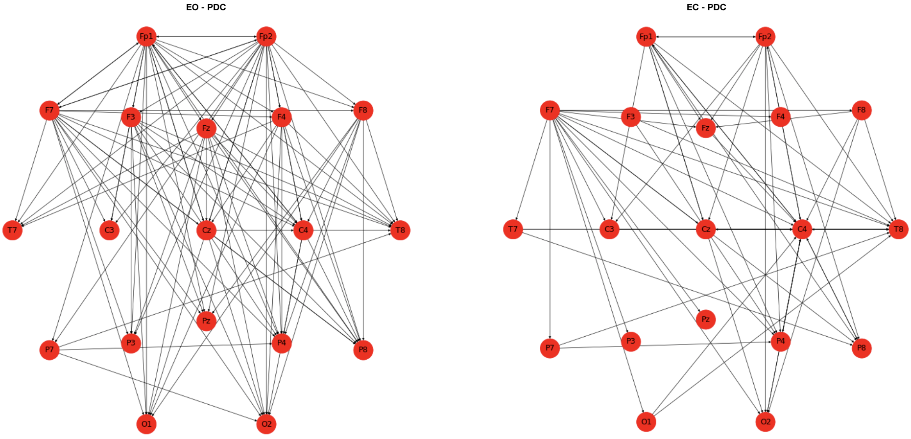
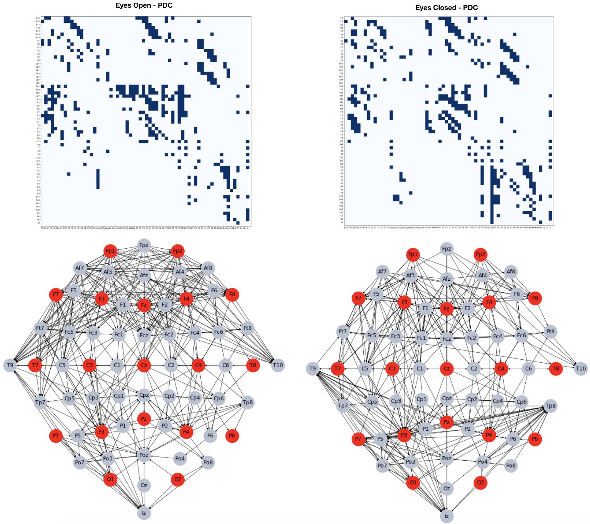

##Introduction

In this work we are going to analyse and describe some aspects of the brain. In particular we would like to understand how the brain behave with respect to functional connectivity: there might be relations between activities recorded in different cerebral areas. It would be interested studying how different regions of the brain interact with each other even though not necessarily connected. 

The data we have are about biomedical signals, in particular electroencephalography data (EEG) recorded on brain scalp during two runs of acquisition: eyes-open (EO) resting state and eyes-closed (EC) resting state.

The **Table 1** shows the list of performed tasks.

## Part 1. Connectivity graph 

In order to estimate functional brain connectivity among the 64 available channels, we can use two Multivariate Autoregressive Models (MVAR) estimators: Partial Directed Coherence (PDC) and Direct Transfer Function (DTF). The former is generally used to follow the temporal evolution of estimated information flows, while the latter is typically used to measure the overall effect of one signal on another. Those measures are based on Granger causality, whose focus is the idea that a time series can be useful in forecasting another one, like if one time series can be improved incorporating the knowledge of another one. We set the frequency sampling equal to 160, the resolution of the model equal to 100 such that each bin will have 1Hz of width and the frequency value equal to 10. We chose 10 because activities within the range 8-15 Hz are linked to relaxed and reflective state or closing eyes state. 

The images in **Figure 1** show the binary adjacency matrices with a network density of the 20% for PDC and DTF in the case of EO and EC. As we can see all the matrices do not underline connections among channels in the center area, expecially on the bottom. There are very few connections among the parietal, temporal and frontal areas of the brain. 

Moreover we wanted to check how the adjacency matrices could look like applying different network density thresholds. We tried other 5 different values for both states (EO, EC) and measures (PDC, DTF): results in **Figure 2**. As we could imagine, lower density values can led to disconnected graphs while higher densities can bring to a graph with a lot of edges and connections among channels. It seems that choosing a network with 20% of density is the optimal way.

Looking at the adjacency matrices, we can notice that some channels tend to be more connected than others, no matter the status, the density or the measure used. For this reason we can analyse a reduced set of channels (19 of the initial 64), fit a MVAR model using Yule-Walker algorithm and estimate PDC measures applying a Bootstrap validation. Using 160 as frequency sample, 200 repetitions of Bootstrap random sampling, and a significance threshold $\alpha=0.05$, we obtain a model in which all values significantly different from 0 have been filtered out. 

To better understand the structure of the networks we obtained we performed a topographical analysis of the graphs and we compared them with each other. In **Figure 3** the networks with 20% of density regarding EO and EC states of both PDC and DTF are represented: the nodes belonging to the reduced set of 19 channels are the red ones. As we can see, most of the red nodes have a lot of connections, expecially if we look at the central channels. There are some other channels, like the one belonging to the temporal lobe that have a lot of incoming links, expecially if we consider the eyes-closed status. In **Figure 4** it is possible to see only the network belonging to the reduced set once performed the PDC estimation: the number of links is strongly reduced but the EO state has more connections between channels of this subset.

Finally, since in the previous analysis we considered a frequency of 10 for the model, we can now check the results with a frequency of 30 and see what happens. Since we know that most of the cerebral signal observed in the scalp EEG falls in the range of 1???20 Hz, we would like to check what happens with an higher frequency, generally associated also to active thinking, high alert or  anxious.
We performed again PDC measure, select a network density of 20% and build a binary adjacency matrix for each resting state and measure. The results are shown in **Figure 5**. The graphs seem to have less edges, expecially considering the central part of the brain. More connections happen in the frontal part in the case of EO status while for the EC status an important role is reached from Tp8 channel, receiving a lot of links from parietal lobe.

## Part 2. Graph theory indices

In this section we want to focus on graph indices. Starting from the adjacency matrices obtained applying a PDC measure to signals coming from EO and EC states, it is possible to create a directed graph and compute some global and local measures. When we refer to global indices we just consider the average of the local measure evaluated in each node.

**Global indices**

- *Clustering coefficient*: shows the tendency of a graph to be divided in to clusters. Since the clustering coefficient of node is always a number between 0 and 1, the closer the local clustering coefficient is to 1, the more likely it is for the network to form clusters.

- *Average shortest path length*: it is the average path length evaluated among all the shortest path computed for a graph. 

The results of the global indices can be found in Table 2. 

**INTERPRETAZIONE**

**Local indices**

To evaluate local analysis we will take into account the degree (number of edges of a node) and, since we are working with directed graphs, the in-degree and out-degree (number of edges incoming and outgoing to or from a node). We computed those measures for EO and EC state and selected the first 10 nodes with highest degrees: the results are in Table 3 (for eyes open) and in Table 4 (for eyes closed). 

**INTERPRETAZIONE**

Since global indices can give us a pretty good overview, we focus on them first comparing the results shown in Table 2 (regarding PDC measure) with the DTF ones (Table 5).

**INTERPRETAZIONE**

\newpage

# TODO:

- Interpretazione parte 2

\newpage

## Tables

|    | Cluster Coefficient | Avg shortest  path length |
|:--:|:-------------------:|:-------------------------:|
| EO |         0.25        |            1.53           |
| EC |         0.34        |            1.87           |
Table: Global indices, PDC

|  Degree |        |   | In Degree |        |   | Out Degree |        |
|:-------:|:------:|:-:|:---------:|:------:|:-:|:----------:|:------:|
| channel | degree |   |  channel  | degree |   |   channel  | degree |
|   Af7   |   27   |   |     P4    |   21   |   |     Af7    |   24   |
|    F1   |   27   |   |     Fz    |   19   |   |     Fp1    |   19   |
|    Fz   |   26   |   |     T7    |   17   |   |     Af3    |   16   |
|    C3   |   24   |   |     P2    |   17   |   |     Fpz    |   14   |
|    F2   |   24   |   |     C3    |   16   |   |     F5     |   14   |
|    P4   |   24   |   |     C4    |   16   |   |     Fp2    |   13   |
|    F3   |   23   |   |     F2    |   16   |   |     F6     |   13   |
|    Cz   |   22   |   |     P3    |   16   |   |     Af4    |   12   |
|    C4   |   21   |   |     Cz    |   15   |   |     F3     |   12   |
|   Fp1   |   21   |   |     F1    |   15   |   |     F1     |   12   |
Table: Local indices, EO

|  Degree |        |   | In Degree |        |   | Out Degree |        |
|:-------:|:------:|:-:|:---------:|:------:|:-:|:----------:|:------:|
| channel | degree |   |  channel  | degree |   |   channel  | degree |
|    F1   |   34   |   |     C4    |   25   |   |     F1     |   15   |
|    Fz   |   32   |   |     P3    |   24   |   |     Af7    |   14   |
|    P3   |   32   |   |     Fz    |   21   |   |     Af4    |   11   |
|    C4   |   31   |   |    Poz    |   20   |   |     F5     |   11   |
|    F3   |   26   |   |     F1    |   19   |   |     F3     |   11   |
|   Poz   |   26   |   |     P4    |   16   |   |     Fz     |   11   |
|   Ft7   |   25   |   |     F3    |   15   |   |     F2     |   11   |
|    T7   |   21   |   |     T7    |   15   |   |     Ft7    |   11   |
|    P2   |   21   |   |     P2    |   15   |   |     C3     |   10   |
|    C3   |   20   |   |    Ft7    |   14   |   |     Af3    |   10   |
Table: Local indices, EC

|    | Cluster Coefficient | Avg shortest  path length |
|:--:|:-------------------:|:-------------------------:|
| EO |         0.40        |            0.81           |
| EC |         0.35        |            0.64           |
Table: Global indices, DTF

\newpage

## Images

