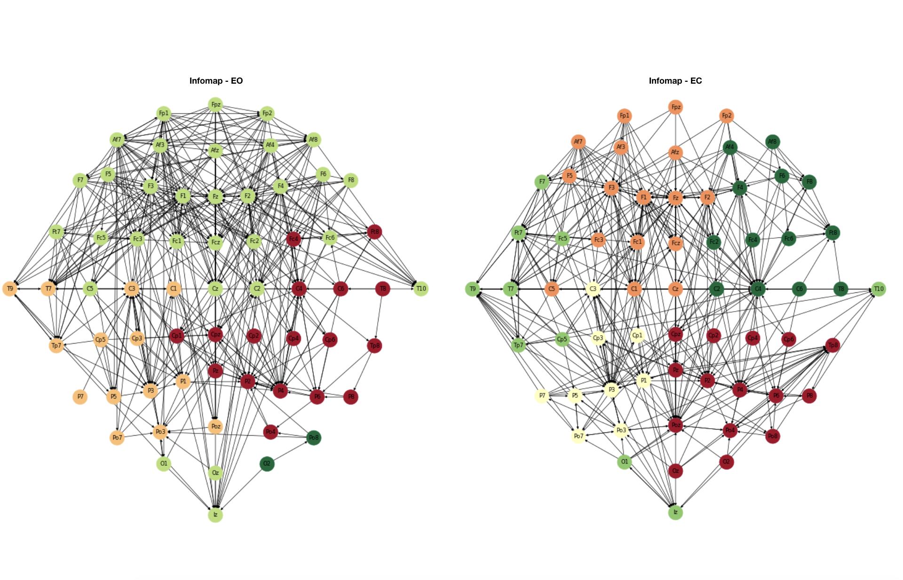

##Abstract

The aim of this work is to understand how the brain behave with respect to functional connectivity: there might be relations between activities recorded in different cerebral areas, and studying how different regions of the brain interact with each other even though not necessarily connected. In this scenario, many aspects of network science come to the rescue, since the brain can be represented as a network where nodes are the different areas of the brain.

More in particular, the data involved in this work [1] comes from biomedical signals, in particular electroencephalography data (EEG) recorded on brain scalp during two runs of acquisition: eyes-open (EO) resting state and eyes-closed (EC) resting state.

The **Table 1** shows the list of performed tasks and all the files and codes involved in this work are available at [https://github.com/tlancian/BI_Homeworks](https://github.com/tlancian/BI_Homeworks).

## Part 1. Connectivity graph 

In order to estimate functional brain connectivity among the 64 available channels, we can use two Multivariate Autoregressive Models (MVAR) estimators: Partial Directed Coherence (PDC) and Direct Transfer Function (DTF). The former is generally used to follow the temporal evolution of estimated information flows, while the latter is typically used to measure the overall effect of one signal on another. Those measures are based on Granger causality, whose focus is the idea that a time series can be useful in forecasting another one, like if one time series can be improved incorporating the knowledge of another one. As explicited in the data, the frequency sampling was set equal to 160. For the resolution of the model we chose 100, since the experiment was run among 100 different frequencies, and so that each bin will have around 1Hz of width. As frequency value we set 10, since the Alpha waves has a frequency within the range 8-15 Hz, and are linked to relaxed and reflective state or closing eyes state. 

The images in **Figure 1** show the binary adjacency matrices with a network density of the 20% for PDC and DTF in the case of EO and EC. As we can see all the matrices do not underline connections among channels in the center area, expecially on the bottom. There are very few connections among the parietal, temporal and frontal areas of the brain. 

Moreover we wanted to check how the adjacency matrices could look like applying different network density thresholds. We tried other 5 different values for both states (EO, EC) and measures (PDC, DTF): results in **Figure 2**. What comes out looking at the different threshold levels, is that some specific channels start to get more incoming connections, i.e. to becoming more statistical dependent with respect to the sources of this connections.

For this reason we have decided to analyse a reduced set of channels (19 of the initial 64), fit a MVAR model using Yule-Walker algorithm and estimate PDC measures applying a Bootstrap validation. Using 200 repetitions of Bootstrap random sampling, and a significance threshold $\alpha=0.05$, we obtain a model in which all values significantly different from 0 have been filtered out. 

To better understand the structure of the networks we obtained, we performed a topographical representation of the graphs. In **Figure 3** the networks with 20% of density regarding EO and EC states of both PDC and DTF are represented: the nodes belonging to the reduced set of 19 channels are the red ones.

What evidently comes out, is the structural difference of the netwroks in the 2 rest-states: in EO the Frontal lobe present many connections, meanwhile it is more sparse in the Parietal lobe, especially at its sides. In the EC state, it happens that there are much more connections in the Parieto-occipital lobe (especially in the right side), meanwhile the number of connections in the Frontal lobe decrease. This part of the brain is exactly the ones that mainly produce the Alpha waves, that comes once in EC state.

And most of the red nodes have a lot of connections, expecially if we look at the central channels. There are some other channels, like the one belonging to the temporal lobe that have a lot of incoming links, expecially if we consider the eyes-closed status. In **Figure 4** it is possible to see only the network belonging to the reduced set once performed the PDC estimation, and results are really similar to the ones of the complete network: more connections in EO state, especially in the Frontal lobe, a more sparse network for the EC state, with the right side of the Parieto-Occipital lobe well connected.

As a final remark, we have taken into account another frequency level, that is 30. This level is related to the Beta waves, that are associated generally to active thinking, high alert or anxious.

We estimated connectivity again via PDC, selected as network density 20%, and build a binary adjacency matrix for each resting state and measure. The results are shown in **Figure 5**. The graphs are less connected than the previous ones, expecially considering the central part of the brain. What comes out is a massive connection in the Frontal lobe, once in EO state, and this is something that makes sense, because the Frontal lobe is the place where Beta waves are mostly produced. And in fact, this is something less evident in the EC state, where still there are many connections in the Parieto-occipital lobe.

## Part 2. Graph theory indices

In this section we want to focus on graph indices, either global and local measures. When we refer to global indices we just consider the average of the local measure evaluated in each node. In order to compute all the indices, we used the library `networkx` in Python, created to efficiently deal with graphs.

**Global indices**

- *Clustering coefficient*: shows the tendency of a graph to be divided in to clusters. Since the clustering coefficient of node is always a number between 0 and 1, the closer the local clustering coefficient is to 1, the more likely it is for the network to form clusters.

- *Average shortest path length*: it is the average path length evaluated among all the shortest path computed for a graph. If two nodes are disconnected, meaning there is no path between them, then the path length between them in infinite. As a consequence, if a network contains disconnected components, then the mean path length also diverges to infinity. One way to avoid this problem is to evaluate this index for each component.

The results of the global indices can be found in Table 2. The signals from EC state are more keen on form clusters than the signals registered from EO status, even if the average shortest path length is bigger for EC rest state. 

**Local indices**

To evaluate local analysis we will take into account the degree (number of edges of a node) and, since we are working with directed graphs, the in-degree and out-degree (number of edges incoming and outgoing to or from a node). We computed those measures for EO and EC state and selected the first 10 nodes with highest degrees: the results are in Table 3 (for EO) and in Table 4 (for EC). From the table is quite clear that there is not a particular brain area with more connections than others: in both cases (EC and EO), we have node with higher degree coming from parietal, frontal or central lobes. Some channels are important in both cases but some other are present only in a state and not in the other. It is the case of Af7 channel, with a lot of outgoing link that is in the first position in EO rank but it's not even in the first ten for the EC state. 

Since global indices can give us a pretty good overview, we focus on them first comparing the results shown in Table 2 (regarding PDC measure) with the DTF ones (Table 5). The graph generated from DTF estimation led to smaller average shortest path length and to highest cluster coefficient. 

Then, we also compared the PDC results considering different density values. As we can see from the plot in **Figure 6**, the behaviour in the EO case is almost costant, expecially for the cluster coefficient. It is clear that, the highest the density the highest the possibility to form clusters is. 

For what concern local indices, we can make a topographical representation of the graph, considering the degree, the in-degree and the out-degree. The graphs in **Figure 7** shown these results: the bigger the dot size is, the highest is the degree for that node. Looking at the graphs we can better undestand also the position of most important channels (red ones belong to the subset of channels considered before). It is easy to find relations with the analysis regarding the 10 nodes with highest degrees. 

As last thing, we also want to compute all the previous graph indices considering a frequency value equal to 30, as we have done before. The results, for global indices are shown in Table 6 and for local ones in Table 7 (for EO) and Table 8 (for EC). As we have seen before, considering an higher frequency led to a graph with less edges, meaning less interactions. The main difference is not only the less number of interactions but also the different channels present in the 10 nodes with highest degrees: in this new case, most of the channels seem to belong to the frontal lobe. 

## Part 3. Motif analysis

In this section, we will cover the problem of detecting the presence of motifs in our networks.
A motif is a configuration of $s$ nodes, that shows up in the graph a significant amount of times. More precisely, the idea behind the detection of motifs, is to understand whether the pattern in the graph is due to randomness, or it's a recurrent pattern that describes something in the phenomena we are interested in. The counterpart of the motif is the anti-motif, that has the same idea behind, but is a pattern that shows up in the network few times.

**Size 3 Motifs**

In order to detect the presence of motifs, we have exploited `mFinder`[2], a tool designed for this purpose by the Weizmann Institute of Science. The results are in Table 9 and Table 10. For the Motif Dictionary, please refer to the relative folder of this part of the work. In general the only difference from the two rest-states, is in the presence of the motif 238 in the EC state. The motif 238 represent the complete clique of 3 nodes with edges in both directions (since it is a directed graph). Since we are taking into account the frequency related to the Alpha waves, the greater connection in the EC state makes perfectly sense.

**Anti-motif 36**

Let's now focus our attention to the anti-motif 36. Although this resulted as an anti-motif in both rest states, it is the most recurrent pattern in the network, and represent the simultaneous connection that two channels has towards a third channel. The main differences can be found looking how the frontal part induce less connections in the EC state, meanwhile the posterior contributes a lot. And in the EO state, the exactly opposite situation can be found, and the cereblal activity is concentrated in the posterior part. This pattern can be clearly observed concentrating our attention on the channel T10, the one of the right ear. In **Figure 8** we can check the graphs with just the connections of motif 36.

**Parieto-Occipital Scalp**

Another interesting insight is the role of the Parieto-Occipital scalp in the motif detections. This is one of the other main channels that plays a different role in the 2 considered rest states. In fact, as we can see this from Table 11 and Table 12, it is involved twice in the EC state, than in the EO state. To notice also, that in the EO state, it's present also in two over the 19 configurations of the motif 238 (the complete clique), with other nodes in the parietal zone. This remark the greater activity that during the rest state EC, the posterior part of our brain has.

**Size 4 Motifs**

The same analysis carried out for motifs of size 3, has been done for the motifs that has size 4. Again, also in this scenario there are more motifs in the EC state (33), than in the EO state (24). Also here, in the EC state, you can find the motifs 13142 and 15262, that represent a quasi-clique, where few edges are missing. Due to space reasons, we are not reporting here the whole table with results, but you can find everything related to this, in the specific folder of this part in the Github repository.

## Part 4. Community detection

The community detection is a clustering task specific for networks. In this work we have taken into account two different approaches to solve the task: modularity-based and information-theory based. Let's take a look to both.

**Modularity Based**

In the modularity setup, the idea is to create communities such that there is a dense connection within the nodes of the community, and a more sparse connection among the single communities. The concept of modularity can be described as the fraction of the edges that fall within the given groups minus the expected fraction if edges were distributed at random, although there is no unique way to define it. In this way, a score can be assigned to each partition of the graph, and the idea is to find the partition that maximizes this score. In fact, many researcher have proposed their algorithms, with many different proposals of the objective function. In this work we have exploited the algorithm proposed by Leicht & Newman [3]. In **Figure 9** results were reported.

In the EC state, the partition seems more defined, and what comes out are 4 communities, separated like in a Cartesian coordinate system. Meanwhile, in the EO state, the right part of the brain makes almost a single community, and it's notable how the channel corresponding to the Inion belong to the community of the frontal part of the brain.

**Information-Theory Based**

This approach has been proposed in 2008 by Rosvall and Bergstrom [4]. The idea behind is that in a community there are interdependent interactions among the users. For instance, an interaction between user A and user B, influence the interaction between user B and user C. The main goal is no more to understand the physical structure in the network, but how the flow of the information can run between components of the network, and group users that share this flow. To solve the problem of finding the optimal clustering of a graph, the idea is to perform a random walk in the network and find a description of minimum information. In **Figure 10** we find the results of the Infomap algorithm applied on the brain networks.

Like in the modularity-based scenario, the EC state seems well-defined, although in the left part the Infomap detect a third community that lies in the left ear area. In this network the flow visually seems well-distributed, and this is why there are more communities.
At the contrary, in the EO state, the network concentrate most of the connections in the whole frontal area, that in fact form a single community. Meanwhile in the Parieto-occipital area, there is a evident division between right and left side, given to the fact that the connections in the right side are very sparse. And finally, also here it is confirmed the link that the Inion in this state has with the Frontal area of the brain. 

## References

[1] https://physionet.org/physiobank/database/eegmmidb/

[2] mFinder, https://www.weizmann.ac.il/mcb/UriAlon/download/network-motif-software

[3] Community Structure in Directed Networks. E. A. Leicht and M. E. J. Newman. Phys. Rev. Lett. 100, 118703 - Published 21 March 2008.

[4] InfoMap - Rosvall and Bergstrom - http://www.mapequation.org

\newpage

## Tables

| Task |   Class   |
|:----:|:---------:|
| 1.1. | Mandatory |
| 1.2. |     A     |
| 1.3. |     A     |
| 1.4. |     D     |
| 1.5. |     C     |
| 1.6. |     B     |
| 2.1. | Mandatory |
| 2.3. |     B     |
| 2.4. |     C     |
| 2.5. |     B     |
| 2.6. |     B     |
| 3.1. | Mandatory |
| 3.2. |     C     |
| 3.3. |     C     |
| 3.4. |     E     |
| 4.1. | Mandatory |
| 4.2. |     B     |
| 4.3. |     C     |
Table: Tasks completed in this work

|    | Cluster Coefficient | Avg shortest  path length |
|:--:|:-------------------:|:-------------------------:|
| EO |         0.25        |            1.53           |
| EC |         0.34        |            1.87           |
Table: Global indices, PDC

|  Degree |        |   | In Degree |        |   | Out Degree |        |
|:-------:|:------:|:-:|:---------:|:------:|:-:|:----------:|:------:|
| channel | degree |   |  channel  | degree |   |   channel  | degree |
|   Af7   |   27   |   |     P4    |   21   |   |     Af7    |   24   |
|    F1   |   27   |   |     Fz    |   19   |   |     Fp1    |   19   |
|    Fz   |   26   |   |     T7    |   17   |   |     Af3    |   16   |
|    C3   |   24   |   |     P2    |   17   |   |     Fpz    |   14   |
|    F2   |   24   |   |     C3    |   16   |   |     F5     |   14   |
|    P4   |   24   |   |     C4    |   16   |   |     Fp2    |   13   |
|    F3   |   23   |   |     F2    |   16   |   |     F6     |   13   |
|    Cz   |   22   |   |     P3    |   16   |   |     Af4    |   12   |
|    C4   |   21   |   |     Cz    |   15   |   |     F3     |   12   |
|   Fp1   |   21   |   |     F1    |   15   |   |     F1     |   12   |
Table: Local indices, EO

|  Degree |        |   | In Degree |        |   | Out Degree |        |
|:-------:|:------:|:-:|:---------:|:------:|:-:|:----------:|:------:|
| channel | degree |   |  channel  | degree |   |   channel  | degree |
|    F1   |   34   |   |     C4    |   25   |   |     F1     |   15   |
|    Fz   |   32   |   |     P3    |   24   |   |     Af7    |   14   |
|    P3   |   32   |   |     Fz    |   21   |   |     Af4    |   11   |
|    C4   |   31   |   |    Poz    |   20   |   |     F5     |   11   |
|    F3   |   26   |   |     F1    |   19   |   |     F3     |   11   |
|   Poz   |   26   |   |     P4    |   16   |   |     Fz     |   11   |
|   Ft7   |   25   |   |     F3    |   15   |   |     F2     |   11   |
|    T7   |   21   |   |     T7    |   15   |   |     Ft7    |   11   |
|    P2   |   21   |   |     P2    |   15   |   |     C3     |   10   |
|    C3   |   20   |   |    Ft7    |   14   |   |     Af3    |   10   |
Table: Local indices, EC

|    | Cluster Coefficient | Avg shortest  path length |
|:--:|:-------------------:|:-------------------------:|
| EO |         0.40        |            0.81           |
| EC |         0.35        |            0.64           |
Table: Global indices, DTF

|                          | EO (freq=10) | EO (freq=30) | EC (freq=10) | EC (freq=30) |
|:------------------------:|:------------:|:------------:|:------------:|:------------:|
|  Clustering Coefficient  |     0.24     |     0.25     |     0.34     |     0.32     |
| Avg shortest path length |     1.53     |     2.76     |     1.87     |     2.55     |
Table: Global indices comparison 

|  Degree |        |   | In Degree |        |   | Out Degree |        |
|:-------:|:------:|:-:|:---------:|:------:|:-:|:----------:|:------:|
| channel | degree |   |  channel  | degree |   |   channel  | degree |
|   Af7   |   24   |   |     Fz    |   18   |   |     Af7    |   21   |
|   Fcz   |   22   |   |    Fcz    |   16   |   |     Fp1    |   18   |
|    Fz   |   22   |   |     T9    |   16   |   |     Fp2    |   17   |
|    T9   |   22   |   |    Poz    |   16   |   |     Fpz    |   15   |
|    F2   |   21   |   |     F2    |   13   |   |     Af8    |   13   |
|    F4   |   21   |   |    T10    |   13   |   |     F7     |   13   |
|   Fp1   |   20   |   |    Cpz    |   12   |   |     Af3    |   12   |
|   Fp2   |   20   |   |     Iz    |   12   |   |     F5     |   11   |
|   Cpz   |   18   |   |     F1    |   11   |   |     F4     |   11   |
|   Af8   |   18   |   |    Fc1    |   10   |   |     Fc5    |   10   |
Table: Local indices EO, frequency = 30Hz

|  Degree |        |   | In Degree |        |   | Out Degree |        |
|:-------:|:------:|:-:|:---------:|:------:|:-:|:----------:|:------:|
| channel | degree |   |  channel  | degree |   |   channel  | degree |
|   Fcz   |   24   |   |    Tp8    |   19   |   |     F3     |   13   |
|   Fc1   |   23   |   |    Fcz    |   17   |   |     Af7    |   11   |
|    F3   |   23   |   |     T9    |   16   |   |     Af3    |   11   |
|    F1   |   23   |   |    Fc1    |   15   |   |     F5     |   11   |
|   Af3   |   22   |   |     Fz    |   15   |   |     Fc2    |   10   |
|    Fz   |   22   |   |     F1    |   14   |   |     Fc4    |   10   |
|    P3   |   22   |   |     P3    |   14   |   |     Fc3    |    9   |
|    T9   |   21   |   |     Iz    |   12   |   |     C3     |    9   |
|   Tp8   |   21   |   |    Af3    |   11   |   |     Cz     |    9   |
|    F2   |   19   |   |     F2    |   11   |   |     Fp1    |    9   |
Table: Local indices EC, frequency = 30Hz

| Motif ID | $f_{G}(G_k)$ | $f_{\tilde{G}}(G_k)$ | $P(f_{\tilde{G}}(G_k) > f_{G}(G_k))$ | $f'_{G}(G_k)$ | Motif/Anti-Motif |
|:--------:|:------------:|:--------------------:|:------------------------------------:|:-------------:|------------------|
| 6 | 346 | 561.9+-13.2 | 1 | 14 | Anti-Motif |
| 12 | 799 | 893.3+-17.1 | 1 | 13 | Anti-Motif |
| 14 | 185 | 276.0+-10.9 | 1 | 8 | Anti-Motif |
| 36 | 1049 | 1227.1+-13.5 | 1 | 15 | Anti-Motif |
| 38 | 354 | 222.3+-12.4 | 0 | 12 | Motif |
| 46 | 74 | 27.6+-4.7 | 0 | 7 | Motif |
| 74 | 455 | 621.6+-14.1 | 1 | 11 | Anti-Motif |
| 78 | 32 | 89.1+-5.9 | 1 | 4 | Anti-Motif |
| 98 | 12 | 20.1+-4.4 | 0,974 | 5 | None |
| 102 | 30 | 43.0+-6.1 | 0,986 | 7 | None |
| 108 | 146 | 61.9+-6.6 | 0 | 9 | Motif |
| 110 | 41 | 29.7+-4.6 | 0,005 | 6 | Motif |
| 238 | 19 | 3.7+-1.7 | 0 | 7 | Motif |
Table: Eyes closed motifs

| Motif ID | $f_{G}(G_k)$ | $f_{\tilde{G}}(G_k)$ | $P(f_{\tilde{G}}(G_k) > f_{G}(G_k))$ | $f'_{G}(G_k)$ | Motif/Anti-Motif |
|:--------:|:------------:|:--------------------:|:------------------------------------:|:-------------:|------------------|
| 6 | 860 | 1064.8+-15.4 | 1 | 14 | Anti-Motif |
| 12 | 834 | 933.1+-16.9 | 1 | 14 | Anti-Motif |
| 14 | 149 | 207.4+-9.3 | 1 | 9 | Anti-Motif |
| 36 | 1076 | 1250.5+-15.0 | 1 | 15 | Anti-Motif |
| 38 | 448 | 304.4+-14.1 | 0 | 11 | Motif |
| 46 | 51 | 20.2+-4.5 | 0 | 5 | Motif |
| 74 | 252 | 371.0+-12.6 | 1 | 7 | Anti-Motif |
| 78 | 12 | 27.5+-3.3 | 1 | 4 | Anti-Motif |
| 98 | 5 | 16.0+-4.4 | 0,998 | 2 | Anti-Motif |
| 102 | 22 | 33.6+-5.8 | 0,987 | 5 | None |
| 108 | 120 | 58.9+-6.4 | 0 | 8 | Motif |
| 110 | 22 | 13.6+-2.9 | 0,006 | 6 | Motif |
| 238 | 3 | 0.6+-0.7 | 0,018 | 2 | None |
Table: Eyes open motifs

| Motif_Id |    Triplet   |
|:--------:|:------------:|
|    38    | [57, 47, 43] |
|    38    | [57, 47, 46] |
|    38    | [61, 57, 46] |
|    38    | [62, 57, 46] |
|    38    | [50, 57, 43] |
|    38    | [57, 43, 64] |
|    38    | [62, 57, 64] |
|    46    | [48, 57, 43] |
|    46    | [49, 57, 43] |
|    46    | [56, 57, 43] |
|    46    | [57, 58, 16] |
|    46    | [57, 58, 46] |
|    108   | [61, 56, 57] |
|    108   | [61, 57, 58] |
|    108   | [62, 57, 58] |
|    110   | [49, 57, 56] |
|    110   | [50, 49, 57] |
|    238   | [48, 49, 57] |
|    238   | [48, 56, 57] |
Table: EC motifs for node 57 (Parieto-Occipital channel)

| Motif_Id |    Triplet   |
|:--------:|:------------:|
|    38    | [61, 57, 12] |
|    38    | [62, 57, 12] |
|    38    |  [48, 57, 9] |
|    38    |  [51, 57, 9] |
|    38    |  [56, 57, 9] |
|    38    | [56, 57, 10] |
|    38    | [56, 57, 12] |
|    38    | [48, 49, 57] |
|    38    | [49, 50, 57] |
|    108   |  [57, 9, 10] |
Table: EO motifs for node 57 (Parieto-Occipital channel)

|                                                             Eyes Closed                                                             |                                                                 Eyes Open                                                                |
|:-----------------------------------------------------------------------------------------------------------------------------------:|:----------------------------------------------------------------------------------------------------------------------------------------:|
| ['Fc5', 'Fc3', 'Fc1', 'Fcz', 'C5', 'C3', 'C1', 'Cp5', 'Fp1', 'Fpz', 'Af7', 'Af3', 'F7', 'F5', 'F3', 'F1', 'Fz', 'Ft7', 'T7', 'Tp7'] | ['Fc5', 'Fc3', 'C5', 'F7', 'F5', 'F3', 'Ft7', 'T7', 'T9', 'Tp7']                                                                         |
| ['Fc2', 'Fc4', 'Fc6', 'C4', 'C6', 'Fp2', 'Afz', 'Af4', 'Af8', 'F2', 'F4', 'F6', 'F8', 'Ft8', 'T8']                                  | ['Fc1', 'Fp1', 'Fpz', 'Fp2', 'Af7', 'Af3', 'Af4', 'Af8', 'T10', 'O1', 'Oz', 'O2', 'Iz']                                                  |
| ['Cz', 'C2', 'Cp3', 'Cp1', 'Cpz', 'Cp2', 'Cp4', 'Cp6', 'Tp8', 'P1', 'Pz', 'P2', 'P4', 'P6', 'P8', 'Poz', 'Po4', 'Po8', 'Oz', 'O2']  | ['Fcz', 'Fc2', 'Cz', 'Afz', 'F1', 'Fz', 'F2', 'Poz']                                                                                     |
| ['T9', 'T10', 'P7', 'P5', 'P3', 'Po7', 'Po3', 'O1', 'Iz']                                                                           | ['Fc4', 'Fc6', 'C2', 'C4', 'C6', 'Cp1', 'Cp2', 'Cp4', 'Cp6', 'F4', 'F6', 'F8', 'Ft8', 'T8', 'Tp8', 'P2', 'P4', 'P6', 'P8', 'Po4', 'Po8'] |
|                                                                                                                                     | ['C3', 'C1', 'Cp5', 'Cp3', 'Cpz', 'P7', 'P5', 'P3', 'P1', 'Pz', 'Po7', 'Po3']                                                            |
Table: Communities by Leicht & Newman Algorithm

|                                                   Eyes Closed                                                   |                                                                                                  Eyes Open                                                                                                 |
|:---------------------------------------------------------------------------------------------------------------:|:----------------------------------------------------------------------------------------------------------------------------------------------------------------------------------------------------------:|
| ['Fc5', 'Cp5', 'F7', 'Ft7', 'T7', 'T9', 'T10', 'Tp7', 'O1', 'Iz']                                               | ['Fc5', 'Fc3', 'Fc1', 'Fcz', 'Fc2', 'Fc6', 'C5', 'Cz', 'C2', 'Fp1', 'Fpz', 'Fp2', 'Af7', 'Af3', 'Afz', 'Af4', 'Af8', 'F7', 'F5', 'F3', 'F1', 'Fz', 'F2', 'F4', 'F6', 'F8', 'Ft7', 'T10', 'O1', 'Oz', 'Iz'] |
| ['Fc3', 'Fc1', 'Fcz', 'C5', 'C1', 'Cz', 'Fp1', 'Fpz', 'Fp2', 'Af7', 'Af3', 'Afz', 'F5', 'F3', 'F1', 'Fz', 'F2'] | ['Fc4', 'C4', 'C6', 'Cp1', 'Cpz', 'Cp2', 'Cp4', 'Cp6', 'Ft8', 'T8', 'Tp8', 'Pz', 'P2', 'P4', 'P6', 'P8', 'Po4']                                                                                            |
| ['Fc2', 'Fc4', 'Fc6', 'C2', 'C4', 'C6', 'Af4', 'Af8', 'F4', 'F6', 'F8', 'Ft8', 'T8']                            | ['C3', 'C1', 'Cp5', 'Cp3', 'T7', 'T9', 'Tp7', 'P7', 'P5', 'P3', 'P1', 'Po7', 'Po3', 'Poz']                                                                                                                 |
| ['C3', 'Cp3', 'Cp1', 'P7', 'P5', 'P3', 'P1', 'Po7', 'Po3']                                                      | ['Po8', 'O2']                                                                                                                                                                                              |
| ['Cpz', 'Cp2', 'Cp4', 'Cp6', 'Tp8', 'Pz', 'P2', 'P4', 'P6', 'P8', 'Poz', 'Po4', 'Po8', 'Oz', 'O2']              |                                                                                                      /                                                                                                     |
Table: Communities by InfoMap Algorithm

\newpage

## Figures

